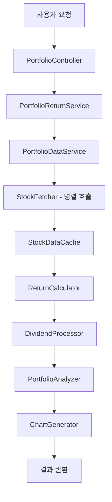

# Portfolio Return Analysis System Architecture

## 개요

StockFetcher를 기반으로 여러 주식의 기간별 Total Return과 Price Return 데이터를 계산하고 차트를 생성하는 포트폴리오 분석 시스템의 전체 아키텍처입니다.

## 시스템 아키텍처

### 1. 전체 모듈 구성

```
Portfolio Return Analysis System
├── Data Layer (데이터 계층)
│   ├── StockFetcher (기존) - 개별 주식 데이터 수집
│   ├── PortfolioDataService - 다중 주식 데이터 통합 관리
│   └── StockDataCache - 데이터 캐싱 레이어
│
├── Business Logic Layer (비즈니스 로직 계층)
│   ├── ReturnCalculator - 수익률 계산 엔진
│   ├── DividendProcessor - 배당금 처리 및 재투자 계산
│   ├── PortfolioAnalyzer - 포트폴리오 분석
│   └── PeriodManager - 기간 관리 및 검증
│
├── Service Layer (서비스 계층)
│   └── PortfolioReturnService - 통합 서비스 파사드
│
├── Presentation Layer (프레젠테이션 계층)
│   ├── ChartGenerator - 차트 생성
│   ├── ChartConfigurationService - 차트 설정 관리
│   ├── ReportGenerator - 리포트 생성
│   └── PortfolioController - REST API 엔드포인트
│
└── Model Layer (모델 계층)
    ├── PortfolioRequest - 포트폴리오 분석 요청 모델
    ├── StockReturnData - 개별 주식 수익률 데이터
    ├── PortfolioReturnData - 포트폴리오 수익률 데이터
    ├── ChartData - 차트 생성용 데이터 모델
    └── AnalysisReport - 분석 결과 리포트 모델
```

## 2. 계층별 상세 설계

### 2.1 Data Layer (데이터 계층)

#### StockFetcher (기존)
- **역할**: Yahoo Finance API를 통한 개별 주식 데이터 수집
- **기능**: 
  - 주식 가격 히스토리 조회 (`fetchHistory`)
  - 배당금 정보 조회 (`fetchDividends`)

#### PortfolioDataService
- **역할**: 여러 주식의 데이터를 효율적으로 수집하고 통합
- **기능**:
  - 다중 주식 데이터 병렬 수집
  - 데이터 정합성 검증
  - 누락 데이터 처리
- **주요 메서드**:
  ```java
  CompletableFuture<Map<String, ChartResponse>> fetchMultipleStocks(List<String> tickers, long period1, long period2)
  CompletableFuture<Map<String, ChartResponse>> fetchMultipleDividends(List<String> tickers, long period1, long period2)
  ```

#### StockDataCache
- **역할**: API 호출 최적화를 위한 캐싱
- **기능**:
  - 최근 조회 데이터 캐싱
  - TTL 기반 캐시 만료
  - 메모리 사용량 관리

### 2.2 Business Logic Layer (비즈니스 로직 계층)

#### ReturnCalculator
- **역할**: 다양한 수익률 계산
- **기능**:
  - **Price Return**: 단순 가격 변화율 계산
    ```
    Price Return = (End Price - Start Price) / Start Price
    ```
  - **Total Return**: 배당금 재투자 포함 수익률
    ```
    Total Return = (End Value + Dividends Reinvested) / Start Value - 1
    ```
  - **CAGR**: 복합 연간 성장률
    ```
    CAGR = (End Value / Start Value)^(1/years) - 1
    ```
- **주요 메서드**:
  ```java
  double calculatePriceReturn(List<Double> prices)
  double calculateTotalReturn(List<Double> prices, List<Dividend> dividends)
  double calculateCAGR(double startValue, double endValue, int years)
  List<Double> calculateCumulativeReturns(List<Double> prices, List<Dividend> dividends)
  ```

#### DividendProcessor
- **역할**: 배당금 데이터 처리 및 재투자 계산
- **기능**:
  - 배당금 지급일 매칭
  - 배당금 재투자 시뮬레이션
  - 배당 수익률 계산

#### PortfolioAnalyzer
- **역할**: 포트폴리오 레벨 분석
- **기능**:
  - 포트폴리오 가중 수익률 계산
  - 리스크 지표 계산 (변동성, 샤프 비율)
  - 상관관계 분석

#### PeriodManager
- **역할**: 분석 기간 관리 및 검증
- **기능**:
  - 기간 유효성 검증
  - 거래일 계산
  - 기간별 데이터 정렬

### 2.3 Service Layer (서비스 계층)

#### PortfolioReturnService
- **역할**: 전체 워크플로우 조율하는 파사드 서비스
- **기능**:
  - 포트폴리오 분석 전체 프로세스 관리
  - 에러 처리 및 복구
  - 결과 데이터 통합
- **주요 메서드**:
  ```java
  PortfolioReturnData analyzePortfolio(PortfolioRequest request)
  ChartData generateChartData(PortfolioReturnData data)
  AnalysisReport generateReport(PortfolioReturnData data)
  ```

### 2.4 Presentation Layer (프레젠테이션 계층)

#### ChartGenerator
- **역할**: 다양한 형태의 차트 생성
- **기능**:
  - **시계열 차트**: Price Return vs Total Return 비교
  - **비교 차트**: 여러 주식 성과 비교
  - **누적 수익률 차트**: 시간에 따른 누적 수익률
  - **성과 요약 차트**: 바 차트, 파이 차트 등
- **지원 형식**: PNG, SVG, JSON (Chart.js용)

#### ChartConfigurationService
- **역할**: 차트 스타일 및 설정 관리
- **기능**:
  - 차트 테마 관리
  - 색상 팔레트 설정
  - 축 설정 및 포맷팅

#### PortfolioController
- **역할**: REST API 엔드포인트 제공
- **주요 엔드포인트**:
  ```
  POST /api/portfolio/analyze - 포트폴리오 분석 실행
  GET /api/portfolio/chart/{analysisId} - 차트 데이터 조회
  GET /api/portfolio/report/{analysisId} - 분석 리포트 조회
  ```

### 2.5 Model Layer (모델 계층)

#### PortfolioRequest
```java
public class PortfolioRequest {
    private List<String> tickers;        // 주식 심볼 목록
    private List<Double> weights;        // 포트폴리오 가중치 (옵션)
    private LocalDate startDate;         // 분석 시작일
    private LocalDate endDate;           // 분석 종료일
    private boolean includeDividends;    // 배당금 포함 여부
}
```

#### StockReturnData
```java
public class StockReturnData {
    private String ticker;
    private double priceReturn;
    private double totalReturn;
    private double cagr;
    private List<Double> cumulativeReturns;
    private List<LocalDate> dates;
}
```

#### PortfolioReturnData
```java
public class PortfolioReturnData {
    private List<StockReturnData> stockReturns;
    private double portfolioPriceReturn;
    private double portfolioTotalReturn;
    private double portfolioCAGR;
    private double volatility;
    private double sharpeRatio;
}
```

## 3. 데이터 플로우



### 상세 플로우

1. **요청 접수**: 사용자가 주식 목록과 분석 기간을 포함한 요청 전송
2. **데이터 수집**: 여러 주식의 가격 및 배당금 데이터를 병렬로 수집
3. **데이터 검증**: 수집된 데이터의 정합성 및 완성도 검증
4. **수익률 계산**: Price Return과 Total Return 계산
5. **포트폴리오 분석**: 포트폴리오 레벨 지표 계산
6. **차트 생성**: 시각화를 위한 차트 데이터 생성
7. **결과 반환**: 분석 결과와 차트를 사용자에게 제공

## 4. 기술 스택

### 현재 기술 스택
- **Framework**: Spring Boot 3.5.3
- **Language**: Java 21
- **HTTP Client**: Apache HttpClient 5
- **JSON Processing**: Jackson
- **Testing**: JUnit 5, WireMock

### 추가 제안 기술 스택
- **차트 생성**: 
  - JFreeChart (서버사이드 이미지 생성)
  - Chart.js (웹 기반 인터랙티브 차트)
- **병렬 처리**: CompletableFuture (Java 내장)
- **캐싱**: Spring Cache + Caffeine
- **데이터 검증**: Spring Validation
- **스케줄링**: Spring Scheduler (정기 데이터 업데이트용)

## 5. 성능 최적화 전략

### 5.1 병렬 처리
- 여러 주식 데이터를 CompletableFuture를 사용하여 병렬 수집
- CPU 집약적인 계산 작업의 병렬화

### 5.2 캐싱 전략
- **L1 Cache**: 애플리케이션 메모리 캐시 (Caffeine)
- **TTL 설정**: 시장 시간 기준 캐시 만료
- **Cache Warming**: 자주 조회되는 데이터 사전 로딩

### 5.3 데이터 최적화
- 필요한 데이터만 선택적 로딩
- 압축된 데이터 형식 사용
- 배치 처리를 통한 API 호출 최소화

## 6. 확장성 고려사항

### 6.1 수평 확장
- 마이크로서비스 아키텍처로 분리 가능
- 로드 밸런싱 지원
- 상태 비저장(Stateless) 설계

### 6.2 기능 확장
- 새로운 수익률 지표 추가 용이
- 다양한 차트 타입 지원
- 다른 데이터 소스 연동 가능

### 6.3 데이터 소스 확장
- 다른 금융 데이터 API 연동
- 실시간 데이터 스트리밍 지원
- 대체 데이터 소스 fallback

## 7. 보안 및 안정성

### 7.1 API 보안
- Rate Limiting 구현
- API 키 관리
- 요청 검증 및 sanitization

### 7.2 에러 처리
- Circuit Breaker 패턴 적용
- Graceful degradation
- 상세한 로깅 및 모니터링

### 7.3 데이터 품질
- 데이터 검증 로직
- 이상치 탐지 및 처리
- 데이터 무결성 보장

## 8. 모니터링 및 운영

### 8.1 메트릭 수집
- API 응답 시간
- 캐시 히트율
- 에러율 및 성공률

### 8.2 로깅
- 구조화된 로깅 (JSON 형식)
- 요청/응답 추적
- 성능 로깅

### 8.3 알림
- 시스템 장애 알림
- 성능 임계치 초과 알림
- 데이터 품질 이슈 알림

이 아키텍처는 확장 가능하고 유지보수가 용이하며, 높은 성능을 제공하는 포트폴리오 분석 시스템을 구축할 수 있도록 설계되었습니다.
